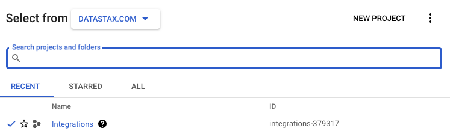

# astra-dataflow-starter

This repository proposes some integration of Astra with Apache Beam and GCP Dataflow.

- [ ] Create Archetype
- [ ] (IO) Read from AstraDB
- [ ] (IO) Write to Astra DB

## Table of Content

**Astra Prerequisites**
- [1. Get an Astra Account](#objectives)
- [2. Get an Astra Token](#acknowledgements)
- [3. Setup Astra CLI](#frequently-asked-questions)
- [4. Create DB](#frequently-asked-questions)


## Astra Prerequisites

### 1. Get an Astra Account

`✅` - Access [https://astra.datastax.com](https://astra.datastax.com) and register with `Google` or `Github` account


### 2. Get an astra token

`✅` - Locate `Settings` (#1) in the menu on the left, then `Token Management` (#2)

`✅` - Select the role `Organization Administrator` before clicking `[Generate Token]`


`✅` - Copy your token in the clipboard. With this token we will now create what is needed for the training.


### 3. Setup Astra CLI

`✅` - Install Cli
```
curl -Ls "https://dtsx.io/get-astra-cli" | bash
source ~/.astra/cli/astra-init.sh
```

`✅` - Setup CLI

```
astra setup --token ${YOUR_TOKEN}
```

### 4. Setup Databases

`✅` - Create database `demo` with keyspace `demo`
```
astra db create demo -k demo
```

`✅` - Create table `simpledata`

```
astra db cqlsh demo -k demo \
  -e "CREATE TABLE IF NOT EXISTS simpledata(id int PRIMARY KEY, data text);" \
  --connect-timeout 20 \
  --request-timeout 20
```

`✅` - Validate table `simpledata` exists
```
astra db cqlsh demo -k demo \
  -e "select * from simpledata" \
  --connect-timeout 20 \
  --request-timeout 20
```

## Google Cloud Platform Prerequisites

### Setup gCloud CLI

`✅` - In the Google Cloud console, on the project selector page, select or [create a Google Cloud project](https://cloud.google.com/resource-manager/docs/creating-managing-projects)

> Note: If you don't plan to keep the resources that you create in this procedure, create a project instead of selecting an existing project. After you finish these steps, you can delete the project, removing all resources associated with the project.
Create a new Project in Google Cloud Console or select an existing one.



`✅` - Make sure that billing is enabled for your Cloud project. Learn how to [check if billing is enabled on a project](https://cloud.google.com/billing/docs/how-to/verify-billing-enabled)

`✅` - Save project ID. The project identifier is available in the column `ID`. We will need it so let's save it as an environment variable
```
export GCP_PROJECT_ID=integrations-379317
export GCP_USER=cedrick.lunven@datastax.com
export GCP_COMPUTE_ENGINE=747469159044-compute@developer.gserviceaccount.com
```

`✅` - Install gCloud CLI
```
curl https://sdk.cloud.google.com | bash
```

`✅` - Associated CLI with project in GCP

```
gcloud init
```

`✅` - Describe the project
```
gcloud projects describe ${GCP_PROJECT_ID}
```

`✅` - Enable APIS
```
gcloud services enable dataflow compute_component logging storage_component storage_api bigquery pubsub datastore.googleapis.com cloudresourcemanager.googleapis.com
```

`✅` - Add Roles. To complete the steps, your user account must have the Dataflow Admin role and the Service Account User role. The Compute Engine default service account must have the Dataflow Worker role. To add the required roles in the Google Cloud console:

```
gcloud projects add-iam-policy-binding ${GCP_PROJECT_ID} --member="user:${GCP_USER}" --role=roles/iam.serviceAccountUser
gcloud projects add-iam-policy-binding ${GCP_PROJECT_ID}  --member="serviceAccount:${GCP_COMPUTE_ENGINE}" --role=roles/dataflow.admin
gcloud projects add-iam-policy-binding ${GCP_PROJECT_ID}  --member="serviceAccount:${GCP_COMPUTE_ENGINE}" --role=roles/dataflow.worker
gcloud projects add-iam-policy-binding ${GCP_PROJECT_ID}  --member="serviceAccount:${GCP_COMPUTE_ENGINE}" --role=roles/storage.objectAdmin
```

### Example 1 - Load Simple Static Data


- Create a db `demo` with keyspace `demo` in the free tier

```
astra db create demo -k demo
```

- Create a keyspace `demo`

```
 mvn -Pdirect-runner compile \
      exec:java \
      -Dexec.mainClass=com.dtx.astra.pipelines.LoadStaticDataIntoAstra \
      -Dexec.args="--keyspace=demo \
        --secureConnectBundle=/Users/cedricklunven/Downloads/scb-demo.zip \
        --token=AstraCS:uZclXTYecCAqPPjiNmkezapR:e87d6edb702acd87516e4ef78e0c0e515c32ab2c3529f5a3242688034149a0e4" \
      -Pdirect-runner
```

