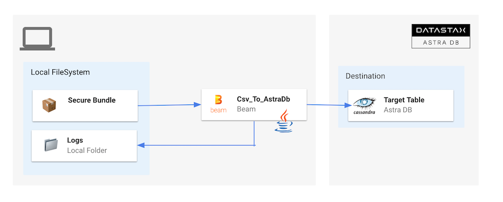
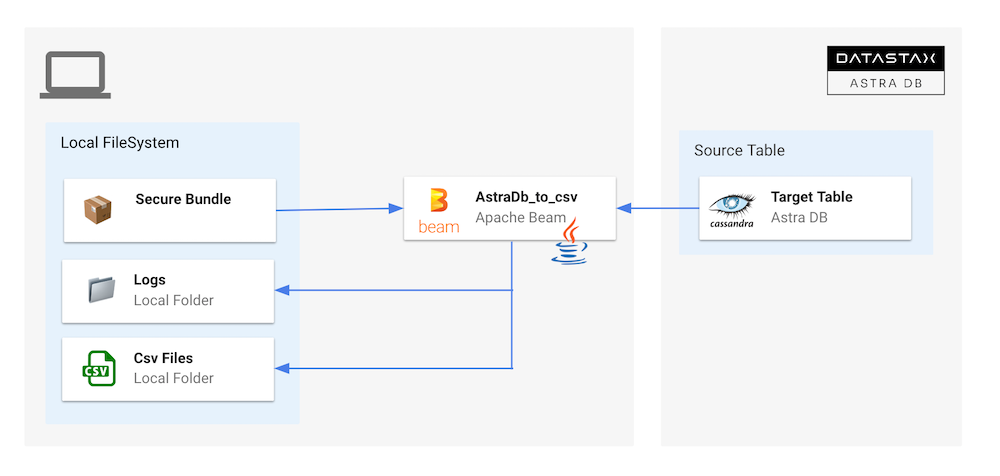

## Astra Data Flow Starter

Sample Apache Beam pipelines to read and write data from Astra DB 
and Astra Streaming.

Those flows leverage the `AstraDbIO` component available at [this repo](https://github.com/clun/beam-sdks-java-io-astra)

## Table Of Content

[**1 - Prerequisites**](#1-database-initialization)
- [1.1 - Setup your local environment](#11---create-an-astra-account)
- [1.2 - Setup your Astra environment](#12---create-an-astra-token)

[**2 - Sample Beam**](#1-database-initialization)
- [2.1 - CSV to Astra](#11---create-an-astra-account)
- [2.2 - Astra to CSV](#12---create-an-astra-token)

[**3 - Samples Dataflow**](#1-database-initialization)

## 1. Prerequisites

### 1.1 Setup your local environment

- ✅ **Install Java Development Kit (JDK) 11+**
      
Use [java reference documentation](https://docs.oracle.com/javase/8/docs/technotes/guides/install/install_overview.html) targetting your operating system to install a Java Development Kit. You can then validate your installation with the following command.

```bash
java --version
```

- ✅ **Install Apache Maven (3.8+)**
      
Samples and tutorials have been designed with `Apache Maven`. Use the [reference documentation](https://maven.apache.org/install.html) top install maven validate your installation with 

```bash
mvn -version
```

- ✅ **Clone this repository**

```bash
git clone https://github.com/DataStax-Examples/astra-dataflow-starter.git
cd astra-dataflow-starter
```

- ✅ **Install the Astra CLI**

```bash
curl -Ls "https://dtsx.io/get-astra-cli" | bash
source ~/.astra/cli/astra-init.sh
```

> ✅ **As an alternative you can run this in the cloud**
> 
> ↗️ _Right Click and select open as a new Tab..._
>
> [](https://gitpod.io/#https://github.com/DataStax-Examples/astra-dataflow-starter)
> 

### 1.2 Setup your Astra environment

- ✅ **Create your DataStax Astra account**:

<a href="https://astra.dev/3B7HcYo">
<br/>
</a>

- ✅ **Create an Astra Token**

> An astra token acts as your credentials, it holds the different permissions. The scope of a token is the whole organization (tenant) but permissions can be edited to limit usage to a single database.

To create a token, please follow [this guide](https://awesome-astra.github.io/docs/pages/astra/create-token/#c-procedure)

The Token is in fact three separate strings: a `Client ID`, a `Client Secret` and the `token` proper. You will need some of these strings to access the database, depending on the type of access you plan. Although the Client ID, strictly speaking, is not a secret, you should regard this whole object as a secret and make sure not to share it inadvertently (e.g. committing it to a Git repository) as it grants access to your databases.

```json
{
  "ClientId": "ROkiiDZdvPOvHRSgoZtyAapp",
  "ClientSecret": "fakedfaked",
  "Token":"AstraCS:fake"
}
```

- ✅ **Set up the CLI with your token**

```
astra setup --token AstraCS:fake
```

- ✅ **Create a Database `demo` and a keyspace `samples_beam`**

```
astra db create demo -k samples_beam --if-not-exists
```

- ✅ **Download the Secure Connect Bundle for current database**

> A _Secure Connect Bundle_ contains the certificates and endpoints informations to open a [mTLS connection](https://www.cloudflare.com/learning/access-management/what-is-mutual-tls/). Often mentionned as `scb` its scope is a database AND a region. If your database is deployed on multiple regions you will have to download the bundle for each one and initiate the connection accordingly. Instructions to [download Secure Connect Bundle are here](/docs/pages/astra/download-scb/)
> 
> 

```
astra db download-scb demo -f /tmp/secure-connect-bundle-db-demo.zip
```

## 2. Sample Apache Beam

### 2.1 - CSV to Astra



- ✅ **Make sure you are in `samples-beam` folder**

```bash
cd samples-beam
pwd
```

- ✅ **Setup environment variables**

```bash
export ASTRA_TOKEN=$(astra token)
export ASTRA_SCB_PATH=/tmp/secure-connect-bundle-db-demo.zip
export ASTRA_KEYSPACE=samples_beam
```

- ✅ **Run the demo**

```bash
 mvn clean compile exec:java \
 -Dexec.mainClass=com.datastax.astra.beam.Csv_to_AstraDb \
 -Dexec.args="\
 --astraToken=${ASTRA_TOKEN} \
 --astraSecureConnectBundle=${ASTRA_SCB_PATH} \
 --keyspace=${ASTRA_KEYSPACE} \
 --csvInput=`pwd`/src/test/resources/language-codes.csv"
```

- ✅ **Check that data is in the table**

```bash
astra db cqlsh demo \
   -k samples_beam \
   -e "SELECT * FROM languages LIMIT 10;"
```

### 2.2 - Astra to CSV



- ✅ **Make sure you are in `samples-beam` folder**

```bash
cd samples-beam
pwd
```

- ✅ **Setup environment variables**

```bash
export ASTRA_TOKEN=$(astra token)
export ASTRA_SCB_PATH=/tmp/secure-connect-bundle-db-demo.zip
export ASTRA_KEYSPACE=samples_beam
```

- ✅ **Run the demo**

```bash
 mvn clean compile exec:java \
 -Dexec.mainClass=com.datastax.astra.beam.AstraDb_To_Csv \
 -Dexec.args="\
 --astraToken=${ASTRA_TOKEN} \
 --astraSecureConnectBundle=${ASTRA_SCB_PATH} \
 --keyspace=${ASTRA_KEYSPACE} \
 --table=languages \
 --csvOutput=`pwd`/src/test/resources/out/language"
```

- ✅ **Check that data is the folder**

```bash
ls -l `pwd`/src/test/resources/out
cat `pwd`/src/test/resources/out/language-00001-of-00004
```


