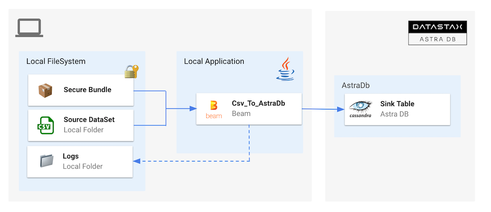
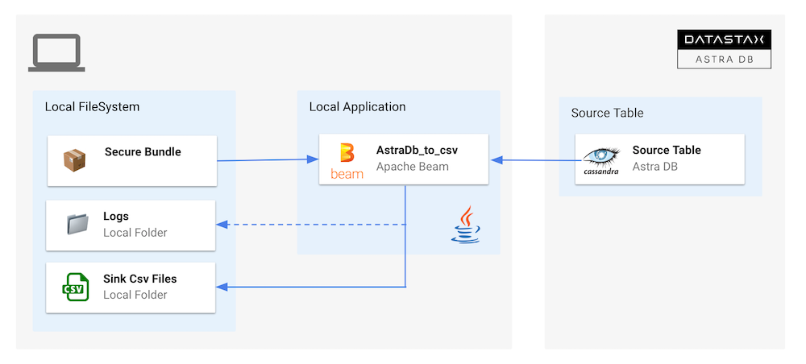
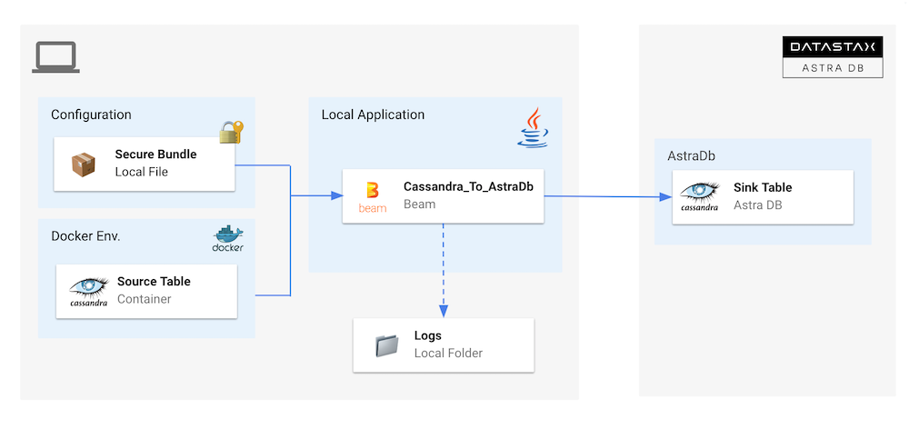
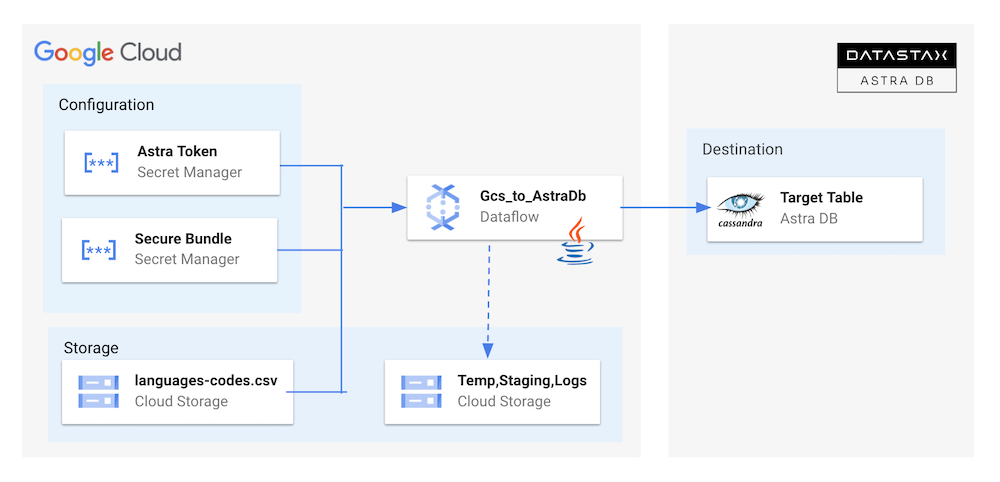
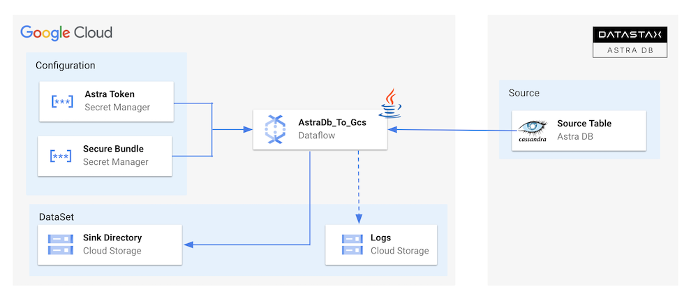
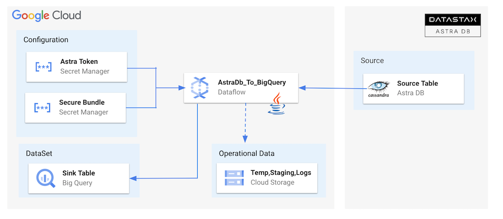
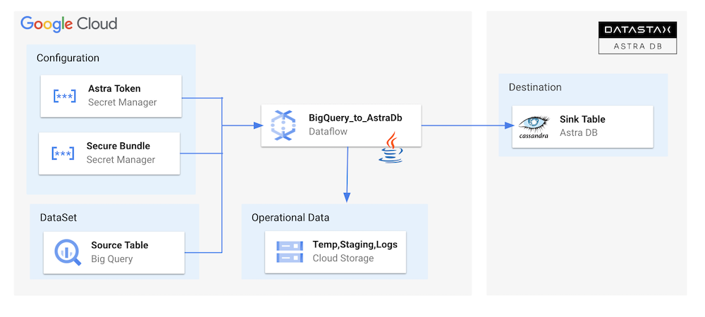

## Astra Data Flow Starter

Sample Apache Beam pipelines to read and write data from Astra DB 
and Astra Streaming.

Those flows leverage the `AstraDbIO` component available at [this repo](https://github.com/clun/beam-sdks-java-io-astra)

## Table Of Content

[**1 - Prerequisites**](#1-prerequisites)
- [1.1 - Setup your local environment](#11-setup-your-local-environment)
- [1.2 - Setup your Astra environment](#12-setup-your-astra-environment)

[**2 - Samples Apache Beam**](#2-sample-apache-beam)
- [2.1 - CSV to Astra](#21---csv-to-astra)
- [2.2 - Astra to CSV](#22---astra-to-csv)
- [2.3 - Cassandra to Astra](#23---cassandra-to-astra)

[**3 - Samples Dataflow**](#3---samples-dataflow)
- [3.1 - Gcs to Astra](#31---gcs-to-astra)
- [3.2 - Astra to Gcs](#32---astra-to-gcs)
- [3.3 - AstraDb to BigQuery](#33---astradb-to-bigquery)
- [3.4 - BigQuery to AstraDb](#34---bigquery-to-astradb)


----

## 1. Prerequisites

### 1.1 Setup your local environment

- ✅ **Install Java Development Kit (JDK) 11+**
      
Use [java reference documentation](https://docs.oracle.com/javase/8/docs/technotes/guides/install/install_overview.html) targetting your operating system to install a Java Development Kit. You can then validate your installation with the following command.

```bash
java --version
```

- ✅ **Install Apache Maven (3.8+)**
      
Samples and tutorials have been designed with `Apache Maven`. Use the [reference documentation](https://maven.apache.org/install.html) top install maven validate your installation with 

```bash
mvn -version
```

- ✅ **Clone this repository**

```bash
git clone https://github.com/DataStax-Examples/astra-dataflow-starter.git
cd astra-dataflow-starter
```

- ✅ **Install the Astra CLI**

```bash
curl -Ls "https://dtsx.io/get-astra-cli" | bash
source ~/.astra/cli/astra-init.sh
```

> ✅ **As an alternative you can run this in the cloud**
> 
> ↗️ _Right Click and select open as a new Tab..._
>
> [](https://gitpod.io/#https://github.com/DataStax-Examples/astra-dataflow-starter)
> 

### 1.2 Setup your Astra environment

- ✅ **Create your DataStax Astra account**:

<a href="https://astra.dev/3B7HcYo">

</a>
<br/>

- ✅ **Create an Astra Token**

> An astra token acts as your credentials, it holds the different permissions. The scope of a token is the whole organization (tenant) but permissions can be edited to limit usage to a single database.

To create a token, please follow [this guide](https://awesome-astra.github.io/docs/pages/astra/create-token/#c-procedure)

The Token is in fact three separate strings: a `Client ID`, a `Client Secret` and the `token` proper. You will need some of these strings to access the database, depending on the type of access you plan. Although the Client ID, strictly speaking, is not a secret, you should regard this whole object as a secret and make sure not to share it inadvertently (e.g. committing it to a Git repository) as it grants access to your databases.

```json
{
  "ClientId": "ROkiiDZdvPOvHRSgoZtyAapp",
  "ClientSecret": "fakedfaked",
  "Token":"AstraCS:fake"
}
```

- ✅ **Set up the CLI with your token**

```
astra setup --token AstraCS:fake
```

- ✅ **Create a Database `demo` and a keyspace `samples_beam`**

```
astra db create demo -k samples_beam --if-not-exists
```

- ✅ **Download the Secure Connect Bundle for current database**

> A _Secure Connect Bundle_ contains the certificates and endpoints informations to open a [mTLS connection](https://www.cloudflare.com/learning/access-management/what-is-mutual-tls/). Often mentionned as `scb` its scope is a database AND a region. If your database is deployed on multiple regions you will have to download the bundle for each one and initiate the connection accordingly. Instructions to [download Secure Connect Bundle are here](/docs/pages/astra/download-scb/)
> 
> 

```
astra db download-scb demo -f /tmp/secure-connect-bundle-db-demo.zip
```

## 2. Sample Apache Beam

### 2.1 - CSV to Astra



#### `2.1.1` - ✅ Make sure you are in `samples-beam`

```bash
cd samples-beam
pwd
```

#### `2.1.2` - ✅ Setup environment variables

```bash
export ASTRA_TOKEN=$(astra token)
export ASTRA_SCB_PATH=/tmp/secure-connect-bundle-db-demo.zip
export ASTRA_KEYSPACE=samples_beam
```

#### `2.1.3` - ✅ Run the demo

```bash
 mvn clean compile exec:java \
 -Dexec.mainClass=com.datastax.astra.beam.Csv_to_AstraDb \
 -Dexec.args="\
 --astraToken=${ASTRA_TOKEN} \
 --astraSecureConnectBundle=${ASTRA_SCB_PATH} \
 --keyspace=${ASTRA_KEYSPACE} \
 --csvInput=`pwd`/src/test/resources/language-codes.csv"
```

#### `2.1.4` - ✅ Check that data is in the table

```bash
astra db cqlsh demo \
   -k samples_beam \
   -e "SELECT * FROM languages LIMIT 10;"
```

### 2.2 - Astra to CSV



#### `2.2.1` - ✅ Make sure you are in `samples-beam` folder

```bash
cd samples-beam
pwd
```

#### `2.2.2` - ✅ Setup environment variables

```bash
export ASTRA_TOKEN=$(astra token)
export ASTRA_SCB_PATH=/tmp/secure-connect-bundle-db-demo.zip
export ASTRA_KEYSPACE=samples_beam
```

#### `2.2.3` - ✅ Run the demo

```bash
 mvn clean compile exec:java \
 -Dexec.mainClass=com.datastax.astra.beam.AstraDb_To_Csv \
 -Dexec.args="\
 --astraToken=${ASTRA_TOKEN} \
 --astraSecureConnectBundle=${ASTRA_SCB_PATH} \
 --keyspace=${ASTRA_KEYSPACE} \
 --table=languages \
 --csvOutput=`pwd`/src/test/resources/out/language"
```

#### `2.2.4` - ✅ Check that data is the folder

```bash
ls -l `pwd`/src/test/resources/out
cat `pwd`/src/test/resources/out/language-00001-of-00004
```

### 2.3 - Cassandra to Astra



#### `2.3.1` - ✅ Make sure you are in `samples-beam` folder

```bash
cd samples-beam
pwd
```

#### `2.3.2` - ✅ Start a Cassandra Cluster Locally

```bash
docker-compose -f ./src/main/docker/docker-compose.yml up -d
```

Wait a few seconds for Cassandra to Start.

```bash
docker-compose -f ./src/main/docker/docker-compose.yml ps | cut -b 55-61
```

#### `2.3.3` - ✅ Validate Cassandra is ready

```bash
docker exec -it `docker ps | grep cassandra:4.1.1 | cut -b 1-12` cqlsh -e "SELECT data_center FROM system.local;"
```

#### `2.3.4` - ✅ Setup environment variables

```bash
export ASTRA_TOKEN=$(astra token)
export ASTRA_SCB_PATH=/tmp/secure-connect-bundle-db-demo.zip
export ASTRA_KEYSPACE=samples_beam
```

#### `2.3.5` - ✅ Empty target table if needed

```bash
astra db cqlsh demo \
   -k samples_beam \
   -e "TRUNCATE languages;"
```

#### `2.3.6` - ✅ Run the demo

```bash
 mvn clean compile exec:java \
 -Dexec.mainClass=com.datastax.astra.beam.Cassandra_To_AstraDb \
 -Dexec.args="\
 --astraToken=${ASTRA_TOKEN} \
 --astraSecureConnectBundle=${ASTRA_SCB_PATH} \
 --keyspace=${ASTRA_KEYSPACE} \
 --cassandraHost=localhost \
 --cassandraPort=9042 \
 --tableName=languages"
```

#### `2.3.7` - ✅ Validate Cassandra Table is populated

```bash
docker exec -it `docker ps \
  | grep cassandra:4.1.1 \
  | cut -b 1-12` \
  cqlsh -e "SELECT *  FROM samples_beam.languages LIMIT 10;"
```

#### `2.3.7` - ✅ Validate Astra Table is populated

```bash
astra db cqlsh demo \
   -k samples_beam \
   -e "SELECT * FROM languages LIMIT 10;"
```

## 3 - Samples Dataflow

### 3.1 - GCS To Astra



#### `3.1.1` - ✅ Create GCP Project

> Note: If you don't plan to keep the resources that you create in this guide, create a project instead of selecting an existing project. After you finish these steps, you can delete the project, removing all resources associated with the project. Create a new Project in Google Cloud Console or select an existing one.

In the Google Cloud console, on the project selector page, select or [create a Google Cloud project](https://cloud.google.com/resource-manager/docs/creating-managing-projects)

#### `3.1.2` - ✅ Enable Billing 

Make sure that billing is enabled for your Cloud project. Learn how to [check if billing is enabled on a project](https://cloud.google.com/billing/docs/how-to/verify-billing-enabled)

#### `3.1.3` - ✅ Save project ID: 

_The project identifier is available in the column `ID`. We will need it so let's save it as an environment variable_

```bash
export GCP_PROJECT_ID=integrations-379317
export GCP_PROJECT_CODE=747469159044
export GCP_USER=cedrick.lunven@datastax.com
export GCP_COMPUTE_ENGINE=747469159044-compute@developer.gserviceaccount.com
```

#### `3.1.4` - ✅ Download and install gCoud CLI

```
curl https://sdk.cloud.google.com | bash
```

#### `3.1.5` - ✅ Authenticate with Google Cloud

Run the following command to authenticate with Google Cloud:
```
gcloud auth login
```

#### `3.1.6` - ✅ Set your project: If you haven't set your project yet, use the following command to set your project ID:

```
gcloud config set project ${GCP_PROJECT_ID}
gcloud projects describe ${GCP_PROJECT_ID}
```

#### `3.1.7` - ✅ Enable needed API

```
gcloud services enable dataflow compute_component \
   logging storage_component storage_api \
   bigquery pubsub datastore.googleapis.com \
   cloudresourcemanager.googleapis.com
```

#### `3.1.8` - ✅ Add Roles to `dataflow` users:** To complete the steps, your user account must have the Dataflow Admin role and the Service Account User role. The Compute Engine default service account must have the Dataflow Worker role. To add the required roles in the Google Cloud console:

```
gcloud projects add-iam-policy-binding ${GCP_PROJECT_ID} \
    --member="user:${GCP_USER}" \
    --role=roles/iam.serviceAccountUser
gcloud projects add-iam-policy-binding ${GCP_PROJECT_ID}  \
    --member="serviceAccount:${GCP_COMPUTE_ENGINE}" \
    --role=roles/dataflow.admin
gcloud projects add-iam-policy-binding ${GCP_PROJECT_ID}  \
    --member="serviceAccount:${GCP_COMPUTE_ENGINE}" \
    --role=roles/dataflow.worker
gcloud projects add-iam-policy-binding ${GCP_PROJECT_ID}  \
    --member="serviceAccount:${GCP_COMPUTE_ENGINE}" \
    --role=roles/storage.objectAdmin
```


#### `3.1.9` - ✅ Make sure you are in `samples-dataflow` folder

```bash
cd samples-dataflow
pwd
```

#### `3.1.10` - ✅ Create `buckets` for the project in cloud storage:** an copy file in this bucket 

```
gsutil mb -c STANDARD -l US gs://astra_dataflow_inputs
gsutil cp src/test/resources/language-codes.csv gs://astra_dataflow_inputs/csv/
gsutil ls
```

#### `3.1.11` - ✅ [Create secrets for the project in secret manager](https://cloud.google.com/secret-manager/docs/creating-and-accessing-secrets#secretmanager-create-secret-gcloud)**. To connect to `AstraDB` you need a token (credentials) and a zip used to secure the transport. Those two inputs should be defined as _secrets_.

    ```
    gcloud secrets create astra-token \
       --data-file <(echo -n "${ASTRA_TOKEN}") \
       --replication-policy="automatic"

    gcloud secrets create cedrick-demo-scb \
       --data-file ${ASTRA_SCB_PATH} \
       --replication-policy="automatic"

    gcloud secrets add-iam-policy-binding cedrick-demo-scb \
        --member="serviceAccount:${GCP_COMPUTE_ENGINE}" \
        --role='roles/secretmanager.secretAccessor'

    gcloud secrets add-iam-policy-binding astra-token \
        --member="serviceAccount:${GCP_COMPUTE_ENGINE}" \
        --role='roles/secretmanager.secretAccessor'
        
    gcloud secrets list
    ```

#### `3.1.12` - ✅ Create new keyspace in the DB if needed

```bash
astra db create-keyspace demo -k samples_dataflow --if-not-exist
```

#### `3.1.13` - ✅ Setup environment variables

```bash
export ASTRA_KEYSPACE=samples_dataflow
export ASTRA_SECRET_TOKEN=projects/747469159044/secrets/astra-token/versions/2
export ASTRA_SECRET_SECURE_BUNDLE=projects/747469159044/secrets/secure-connect-bundle-demo/versions/1
export GCP_INPUT_CSV=gs://astra_dataflow_inputs/csv/language-codes.csv
```

#### `3.1.14` - ✅ Run the demo

```bash
 mvn compile exec:java \
 -Dexec.mainClass=com.datastax.astra.dataflow.Gcs_To_AstraDb \
 -Dexec.args="\
 --astraToken=${ASTRA_SECRET_TOKEN} \
 --astraSecureConnectBundle=${ASTRA_SECRET_SECURE_BUNDLE} \
 --keyspace=${ASTRA_KEYSPACE} \
 --csvInput=${GCP_INPUT_CSV} \
 --project=${GCP_PROJECT_ID} \
 --runner=DataflowRunner \
 --region=us-central1"
```

#### `3.1.15` - ✅ Check that data is in the table**

```bash
astra db cqlsh demo \
   -k samples_dataflow \
   -e "SELECT * FROM languages LIMIT 10;"
```

### 3.2 - Astra To GCS



We assume that you have already executed pipeline described in `3.1` and that gloud is set up.

#### `3.2.1` - ✅ Make sure you have those variables initialized

```bash
export ASTRA_KEYSPACE=samples_dataflow
export ASTRA_SECRET_TOKEN=projects/747469159044/secrets/astra-token/versions/2
export ASTRA_SECRET_SECURE_BUNDLE=projects/747469159044/secrets/secure-connect-bundle-demo/versions/1
export GCP_PROJECT_ID=integrations-379317
```

#### `3.2.2` - ✅ Create a bucket to save the exported values

```bash
gsutil mb -c STANDARD -l US gs://astra_dataflow_outputs
export GCP_OUTPUT_CSV=gs://astra_dataflow_outputs
```

#### `3.2.3` - ✅ Make sure you are in `samples-dataflow` folder

```bash
cd samples-dataflow
pwd
```

#### `3.2.4` - ✅ Run the pipeline

```bash
 mvn compile exec:java \
 -Dexec.mainClass=com.datastax.astra.dataflow.AstraDb_To_Gcs \
 -Dexec.args="\
 --astraToken=projects/747469159044/secrets/astra-token/versions/2 \
 --astraSecureConnectBundle=projects/747469159044/secrets/secure-connect-bundle-demo/versions/1 \
 --keyspace=samples_dataflow \
 --table=languages \
 --outputFolder=gs://astra_dataflow_output \
 --runner=DataflowRunner \
 --project=integrations-379317 \
 --region=us-central1"
```

### 3.3 - AstraDb To BigQuery



> ```
> ⚠ Prerequisites:
> - To setup the gcp project please follows setups in `3.1`
> ```

#### `3.3.1` - ✅ Make sure you are in `samples-dataflow` folder

```bash
cd samples-dataflow
pwd
```

#### `3.3.2` - ✅ Make sure you have those variables initialized

```bash
export ASTRA_KEYSPACE=samples_dataflow
export ASTRA_SECRET_TOKEN=projects/747469159044/secrets/astra-token/versions/2
export ASTRA_SECRET_SECURE_BUNDLE=projects/747469159044/secrets/secure-connect-bundle-demo/versions/1
export GCP_OUTPUT_CSV=gs://astra_dataflow_outputs/csv/language-codes.csv
export GCP_PROJECT_ID=integrations-379317
```

#### `3.3.3` - ✅ Create a dataset in `dataflow_input_us` BigQuery with the following command

```bash
export GCP_BIGQUERY_DATASET=dataflow_input_us
bq mk ${GCP_BIGQUERY_DATASET}
bq ls --format=pretty
```

#### `3.3.4` - ✅ Create a json `schema_language_codes.json` file with the schema of the table** We have created it for you [here](samples-dataflow/src/main/resources/schema_language_codes.json)
 
```json
[
  {
    "mode": "REQUIRED",
    "name": "code",
    "type": "STRING"
  },
  {
    "mode": "REQUIRED",
    "name": "language",
    "type": "STRING"
  }
]
```

#### `3.3.5` - ✅ Create a table with specified schema

```bash
export GCP_BIGQUERY_TABLE=destination
bq mk --table --schema src/main/resources/schema_language_codes.json ${GCP_BIGQUERY_DATASET}.${GCP_BIGQUERY_TABLE}
```

#### `3.3.6` - ✅ List tables in your dataset

```bash
bq ls --format=pretty ${GCP_PROJECT_ID}:${GCP_BIGQUERY_DATASET}
```

#### `3.3.7` - ✅ Get Table schema

```bash
bq show --schema --format=prettyjson ${GCP_PROJECT_ID}:${GCP_BIGQUERY_DATASET}.${GCP_BIGQUERY_TABLE}
```

#### `3.3.8` - ✅ Run the pipeline

```bash
mvn compile exec:java \
 -Dexec.mainClass=com.datastax.astra.dataflow.AstraDb_To_BigQuery \
 -Dexec.args="\
 --astraToken=${ASTRA_SECRET_TOKEN} \
 --astraSecureConnectBundle=${ASTRA_SECRET_SECURE_BUNDLE} \
 --keyspace=samples_dataflow \
 --table=languages \
 --bigQueryDataset=${GCP_BIGQUERY_DATASET} \
 --bigQueryTable=${GCP_BIGQUERY_TABLE} \
 --runner=DataflowRunner \
 --project=${GCP_PROJECT_ID} \
 --region=us-central1"
```

#### `3.3.9` - ✅ Show the Content of the Table

```bash
bq head -n 10 ${GCP_BIGQUERY_DATASET}.${GCP_BIGQUERY_TABLE}
```

### 3.4 - BigQuery to AstraDb


 
> ```
> ⚠ Prerequisites:
> - To setup the gcp project please follows setups in `3.1` 
> - To have the BigQuery table populated follows steps in `3.3`
> ```

#### `3.4.1` - ✅ Make sure you are in `samples-dataflow` folder

```bash
cd samples-dataflow
pwd
```

#### `3.4.2` - ✅ Make sure you have those variables initialized

_Replace with values coming from your gcp project. 
The destination table has been created in flow `3.3`_

```bash
export ASTRA_KEYSPACE=samples_dataflow
export ASTRA_SECRET_TOKEN=projects/747469159044/secrets/astra-token/versions/2
export ASTRA_SECRET_SECURE_BUNDLE=projects/747469159044/secrets/secure-connect-bundle-demo/versions/1
export GCP_PROJECT_ID=integrations-379317
export GCP_BIGQUERY_DATASET=dataflow_input_us
export GCP_BIGQUERY_TABLE=destination
```

#### `3.4.3` - ✅ Empty the destination table in Astra

```bash
astra db cqlsh demo \
  -k ${ASTRA_KEYSPACE} \
  -e "TRUNCATE languages;"
```

#### `3.4.4` - ✅ Run the Pipeline

```bash
mvn compile exec:java \
 -Dexec.mainClass=com.datastax.astra.dataflow.BigQuery_To_AstraDb \
 -Dexec.args="\
 --astraToken=${ASTRA_SECRET_TOKEN} \
 --astraSecureConnectBundle=${ASTRA_SECRET_SECURE_BUNDLE} \
 --keyspace=samples_dataflow \
 --bigQueryDataset=${GCP_BIGQUERY_DATASET} \
 --bigQueryTable=${GCP_BIGQUERY_TABLE} \
 --runner=DataflowRunner \
 --project=${GCP_PROJECT_ID} \
 --region=us-central1"
```


#### `3.4.5` - ✅ Validate Destination Table has been populated

```bash
astra db cqlsh demo \
  -k ${ASTRA_KEYSPACE} \
  -e "select * FROM languages LIMIT 10;"
```


